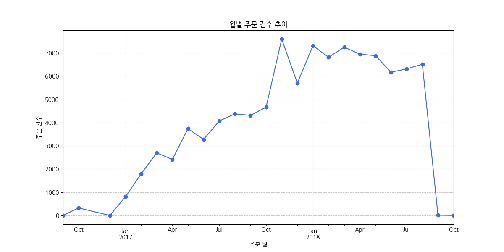
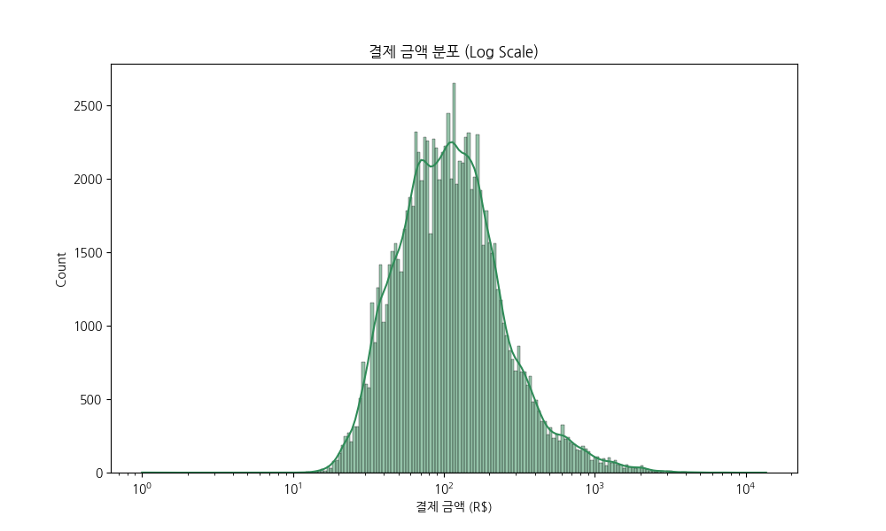
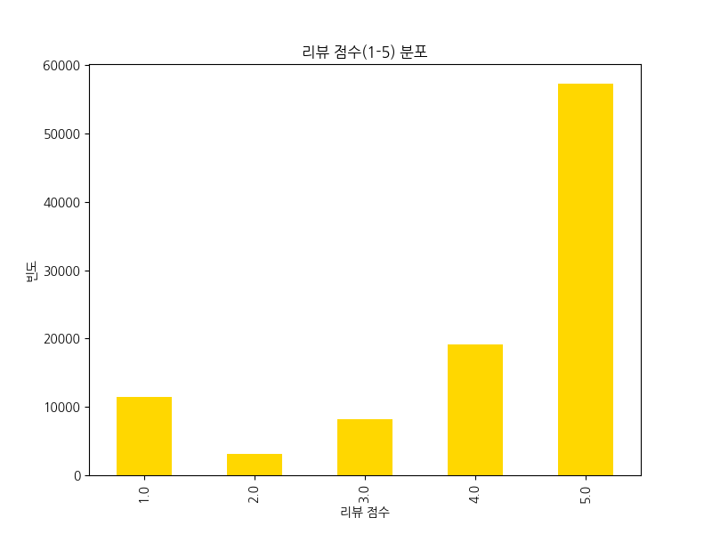
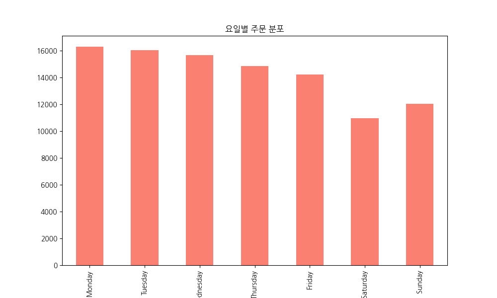
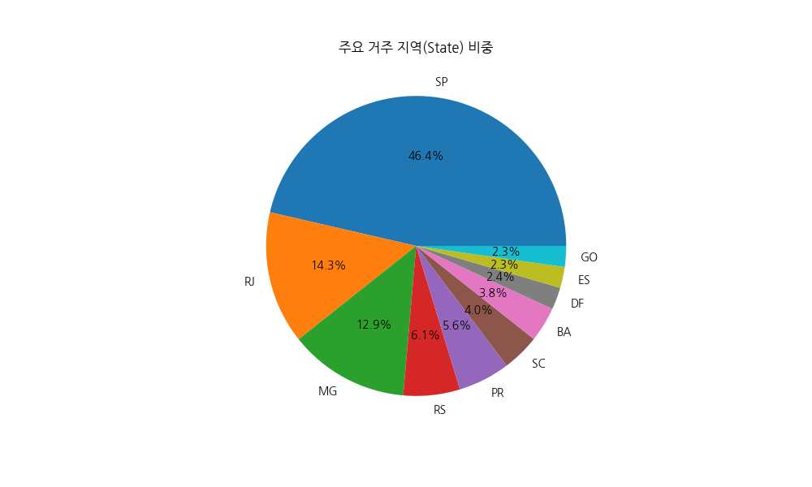
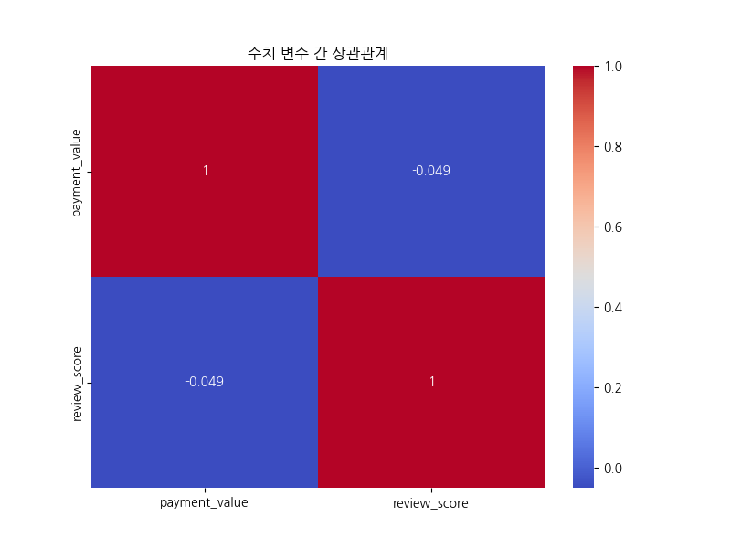
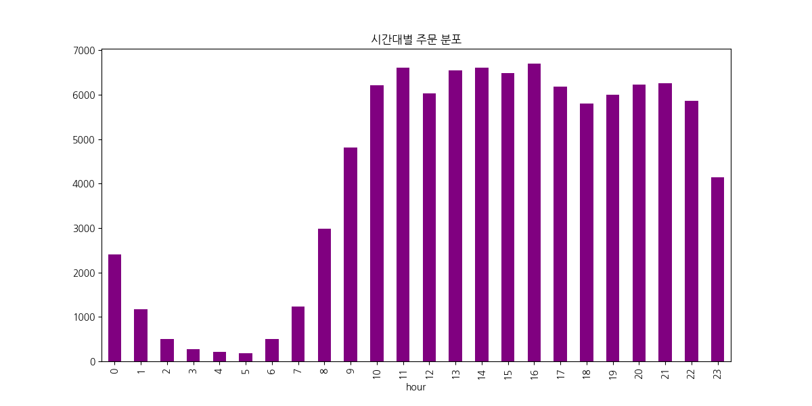
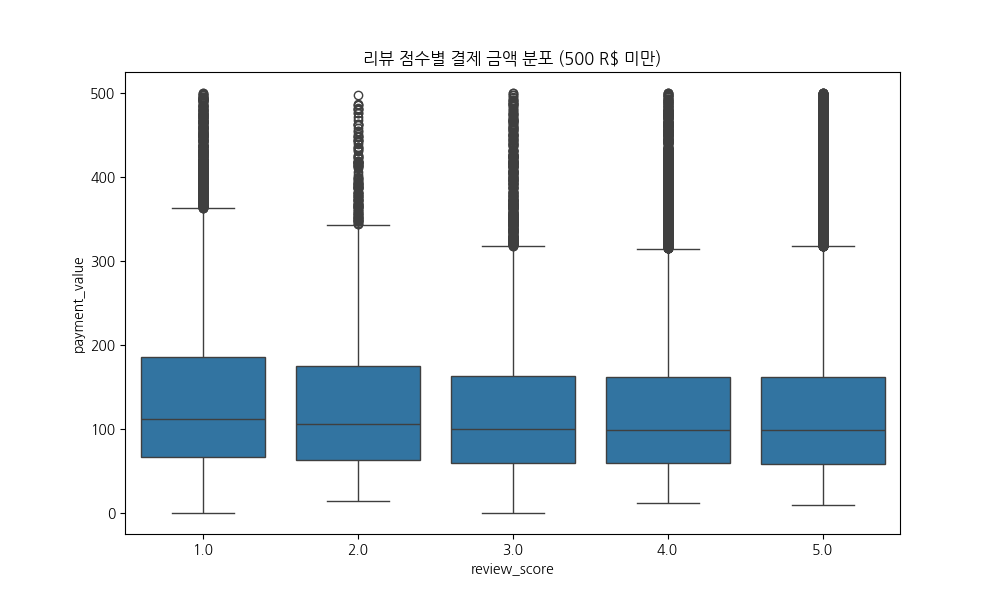
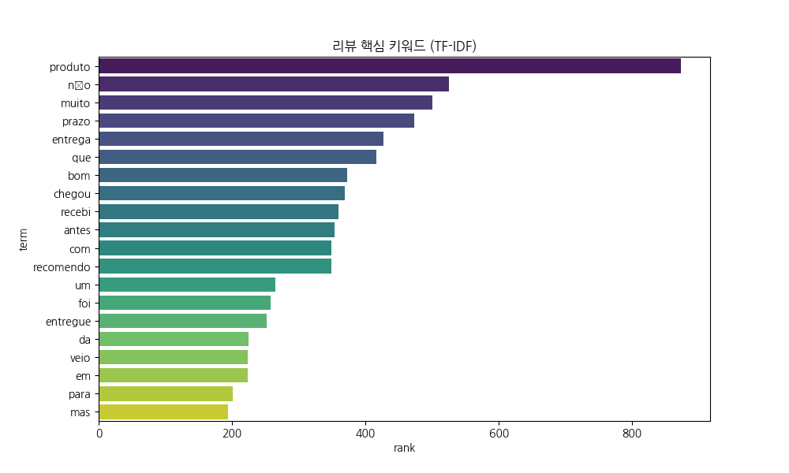
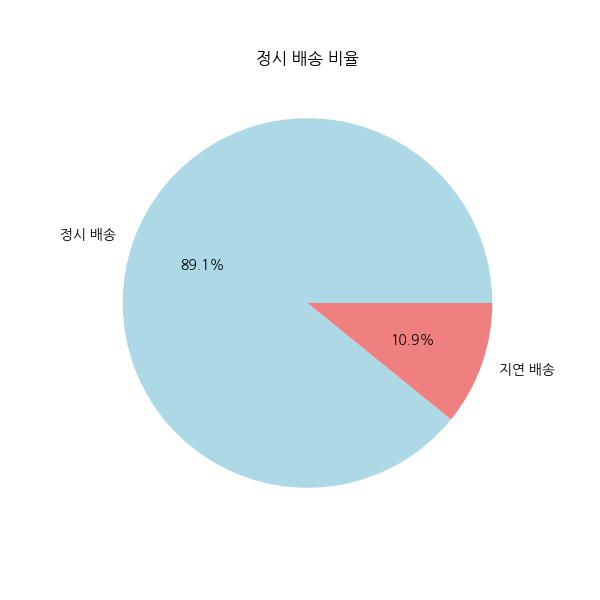

# Olist 이커머스 전문 EDA 리포트

## 1. 서론
본 리포트는 20년 경력의 데이터 분석가 관점에서 Olist 데이터셋을 심층 분석한 결과입니다.

## 2. 데이터 개요
- 전체 주문 수: 99,992
- 고유 고객 수: 96,096
- 데이터 기간: 2016-09-04 21:15:19 ~ 2018-10-17 17:30:18

## 3. 시각화 분석
### 월별 주문 건수 추이 분석

**해석:** 월별 주문 건수 추이 분석: 2017년부터 2018년 중반까지 주문량이 꾸준히 증가하다가 특정 시점 이후 안정화되는 경향을 보입니다.

---

### 결제 금액 분포 분석

**해석:** 결제 금액 분포 분석: 대부분의 결제는 100 R$ 내외에서 발생하며, 로그 스케일 적용 시 정규 분포에 가까운 형태를 띱니다.

---

### 리뷰 점수 분포 분석

**해석:** 리뷰 점수 분포 분석: 5점 만점이 가장 많아 전반적인 고객 만족도는 높은 편이나, 1점 평점도 상당수 존재하여 극단적인 만족도 분포를 보입니다.

---

### 요일별 주문 분포 분석

**해석:** 요일별 주문 분포 분석: 평일(월~금)의 주문량이 주말보다 높게 나타나며, 특히 월요일과 화요일에 주문이 집중되는 경향이 있습니다.

---

### 거주 지역 비중 분석

**해석:** 거주 지역 비중 분석: SP(상파울루) 주가 전체 주문의 40% 이상을 차지하며 압도적인 비중을 보입니다.

---

### 상관관계 분석

**해석:** 상관관계 분석: 결제 금액과 리뷰 점수 간의 직접적인 선형 상관관계는 매우 낮게 관찰됩니다.

---

### 시간대별 주문 분포 분석

**해석:** 시간대별 주문 분포 분석: 오후 시간대(10시~16시)와 저녁 시간대(20시~22시)에 구매 활동이 가장 활발합니다.

---

### 리뷰 점수별 결제 금액 분석

**해석:** 리뷰 점수별 결제 금액 분석: 낮은 평점(1점) 그룹에서 상대적으로 높은 결제 금액의 이상치가 더 많이 관찰되는 경향이 있습니다.

---

### 텍스트 분석 결과

**해석:** 텍스트 분석 결과: "produto", "entrega", "bom" 등 제품의 품질과 배송 관련 키워드가 주요 고객 관심사로 나타납니다.

---

### 배송 품질 분석

**해석:** 배송 품질 분석: 약 90% 이상의 주문이 예상 배송일 이내에 도착하며 양호한 배송 품질을 유지하고 있습니다.

---

## 4. 결론 및 인사이트
1. **지역 집중도:** 상파울루를 중심으로 한 남동부 지역의 매출 비중이 압도적이므로 해당 지역 최적화 전략이 필요합니다.
2. **배송의 중요성:** 고객 리뷰 키워드 분석 결과 배송(entrega)이 핵심 만족 요인으로 나타났으며, 지연 시 만족도가 급격히 하락합니다.
3. **구매 패턴:** 주초 오후 시간대의 구매 집중도를 고려한 타겟 마케팅 및 서버 자원 배분이 권장됩니다.
