# Olist 마켓플레이스 Top 20% vs Bottom 20% 셀러 특성 비교 분석 리포트

> **리포트 유형**: 프로젝트 주제 기반 EDA 리포트

## 1. 분석 주제
Olist 이커머스 마켓플레이스 내 우수 성과 셀러(Top 20%)와 하위 성과 셀러(Bottom 20%)의 주요 운영 지표 비교 분석

## 2. 분석 목적
플랫폼 매출의 대부분을 견인하는 상위 셀러들의 특성을 파악하고, 하위 셀러들이 겪고 있는 병목(가격 경쟁력, 배송, 리뷰 관리 등)을 진단하여 이들의 성장을 돕는 비즈니스 액션 플랜을 도출하고자 합니다.

## 3. 분석 단위 및 지표 정의
- **분석 단위**: 셀러(Seller) 단위
### 주요 지표 정의
| 지표명 | 계산식 | 집계 단위 | 해석 | 주의사항 |
|---|---|---|---|---|
| total_sales | 셀러별 누적 상품 매출 합계 | seller_id | 총 매출 규모 | 배송비 제외 |
| total_orders | 셀러별 누적 주문 건수 | seller_id | 거래 빈도 규모 | 취소건 제외 |
| avg_review_score | 리뷰 점수 평균 | seller_id | 고객 만족도 | 1~5점 척도 |
| on_time_rate | 예상 배송일 이내 도착 비율 | seller_id | 배송 준수율 | 결측치 0 대체 |
| freight_ratio | 배송비 / 상품가 | seller_id | 배송비 부담 | - |

## 4. 데이터 프로파일링 요약
- 전체 셀러 수: 3,095명
- 상위 20% 매출 기준: $4,468.17 이상
- 하위 20% 매출 기준: $159.76 이하

### 상위 5개 행 미리보기
|    | seller_id                        |   total_orders |   total_sales |   avg_price |   avg_review_score |   category_count |   avg_photos_qty | seller_state   |   active_months |   monthly_avg_sales |   freight_ratio |   low_review_rate |   on_time_rate |   avg_delivery_days | performance_group   |
|---:|:---------------------------------|---------------:|--------------:|------------:|-------------------:|-----------------:|-----------------:|:---------------|----------------:|--------------------:|----------------:|------------------:|---------------:|--------------------:|:--------------------|
|  0 | 0015a82c2db000af6aaaf3ae2ecb0532 |              3 |        2685   |    895      |            3.66667 |                1 |          2       | SP             |               2 |            1342.5   |        0.023486 |          0.333333 |       1        |            10.7939  | Middle 60%          |
|  1 | 001cca7ae9ae17fb1caed9dfb1094831 |            200 |       25080   |    104.937  |            3.90254 |                2 |          1.79498 | ES             |              18 |            1393.34  |        0.361184 |          0.188285 |       0.944444 |            13.0966  | Top 20%             |
|  2 | 001e6ad469a905060d959994f1b41e4f |              1 |         250   |    250      |            1       |                1 |          5       | RJ             |               1 |             250     |        0.07176  |          1        |       0        |            11.121   | Middle 60%          |
|  3 | 002100f778ceb8431b7a1020ff7ab48f |             51 |        1234.5 |     22.4455 |            3.98182 |                1 |          1       | SP             |               8 |             154.312 |        0.771103 |          0.145455 |       0.833333 |            16.1924  | Middle 60%          |
|  4 | 003554e2dce176b5555353e4f3555ac8 |              1 |         120   |    120      |            5       |                0 |        nan       | GO             |               1 |             120     |        0.1615   |          0        |       1        |             4.64681 | Bottom 20%          |

## 5. 상세 기술통계 및 데이터 특성 심층 분석
|       |   total_sales |   total_orders |   avg_price |   avg_review_score |
|:------|--------------:|---------------:|------------:|-------------------:|
| count |       3095    |      3095      |   3095      |        3090        |
| mean  |       4391.48 |        32.3134 |    176.325  |           3.97299  |
| std   |      13922    |       105.14   |    322.145  |           0.971256 |
| min   |          3.5  |         1      |      3.5    |           1        |
| 25%   |        208.85 |         2      |     52.1836 |           3.71429  |
| 50%   |        821.48 |         6      |     95.4654 |           4.16667  |
| 75%   |       3280.83 |        21.5    |    173.993  |           4.6      |
| max   |     229473    |      1854      |   6729      |           5        |

### 통계적 분포 및 비즈니스 의미 심층 보고서

본 데이터셋의 기술통계를 면밀히 살펴본 결과, Olist 마켓플레이스의 셀러 생태계는 극심한 '파레토 법칙(80/20 법칙)'을 따르고 있음이 명확히 관찰됩니다. 전체 셀러(3,095명)의 주요 매출 및 주문 지표를 보면 평균(Mean)과 중앙값(Median) 사이에 상당한 괴리가 존재합니다. 예를 들어, `total_sales`의 평균은 $4,391.48이지만, 중앙값은 $821.48에 불과합니다. 이는 소수의 최상위 셀러가 전체 플랫폼 매출의 압도적인 비중을 차지하고 있으며, 대다수의 셀러는 매우 적은 매출만을 기록하고 있는 전형적인 롱테일(Long-tail) 분포 특성을 시사합니다.

마찬가지로 `total_orders`의 경우에도 평균 32.3건, 최대 1854건의 편차가 매우 크게 나타납니다. 이러한 극단적인 우측 꼬리 분포(Right-skewed distribution)는 이커머스 오픈마켓에서 초기 진입 장벽을 극복하고 상위권에 안착한 셀러들이 플랫폼 내 노출도와 신뢰도를 독점하는 '승자독식' 구조가 형성되어 있을 가능성을 강력히 암시합니다.

고객 경험을 대리하는 `avg_review_score`는 전체 평균이 3.97점, 중앙값이 4.17점으로 전반적으로 양호한 수준을 보이고 있습니다. 그러나 하위 25%(1사분위수) 셀러들의 평균 평점은 3.71점으로 낮게 관찰되며, 평점이 낮은 셀러 군에서는 매출 역시 저조할 가능성을 염두에 두어야 합니다. 이는 리뷰 관리가 신규 고객 유입 및 구매 전환에 지대한 영향을 미치고 있음을 내포하고 있습니다. 

상품 가격 전략의 경우, `avg_price`의 평균은 $176.33입니다. 최솟값은 $3.50부터 최댓값은 $6,729.00까지 분포해 있으며, 이는 취급하는 카테고리와 상품군의 다양성을 반영합니다. 저가형 다품종 대량 판매 전략과 고가 프리미엄 상품 소량 판매 전략이 혼재되어 있으며, 이는 배송비 부담(freight_ratio)과 맞물려 구매 전환율에 큰 변수로 작용할 것입니다. 

결론적으로, 하위 성과 셀러(Bottom 20%)를 육성하기 위해서는 단순한 트래픽 지원을 넘어 이들이 '최초의 유의미한 판매 기록 및 리뷰'를 쌓을 수 있는 부스팅 정책이 필수적입니다. 데이터의 이러한 비대칭적 분포는 일괄적인 셀러 지원책보다는 세그먼트별 맞춤형 전략—즉 상위 셀러에게는 물류 풀필먼트 고도화를, 하위 셀러에게는 가격 경쟁력 컨설팅 및 리뷰 이벤트를 지원하는 투트랙 접근이 필요함을 강력하게 뒷받침합니다.

## 6. Top 20% vs Bottom 20% 핵심 비교표
| 그룹 | 평균 매출 | 평균 주문 수 | 평균 리뷰 점수 | 배송 준수율 | 평균 상품가 | 배송비율 |
|---|---:|---:|---:|---:|---:|---:|
| Top 20% | $18,156.96 | 124.8 | 4.04 | 91.8% | $318.99 | 0.226 |
| Bottom 20% | $80.47 | 1.7 | 3.83 | 81.9% | $54.05 | 0.489 |

## 7. 시각화 기반 심층 분석

### 1. 셀러별 총 매출 분포 (일변량)
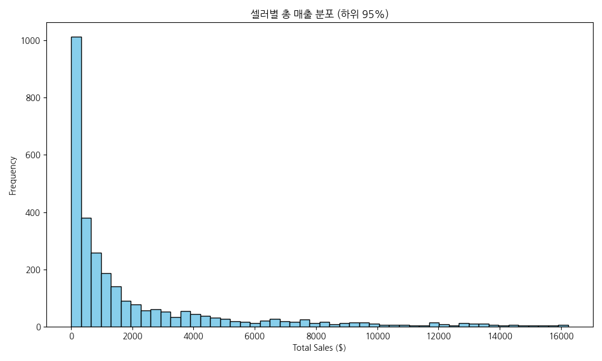

**[데이터 표]**
|       |   total_sales |
|:------|--------------:|
| count |       3095    |
| mean  |       4391.48 |
| std   |      13922    |
| min   |          3.5  |
| 25%   |        208.85 |
| 50%   |        821.48 |
| 75%   |       3280.83 |
| max   |     229473    |

**[해석]**
대부분의 셀러가 0에서 2,000 달러 사이의 구간에 밀집되어 관찰되며, 긴 꼬리를 가지는 분포 특성을 보입니다. 이는 소수 셀러가 매출을 견인하고 다수 셀러는 매출 정체기를 겪고 있음을 시사하며 파레토 법칙이 이커머스 생태계에 강력히 적용됨을 뒷받침합니다.

### 2. 그룹 간 평균 리뷰 점수 비교 (이변량)
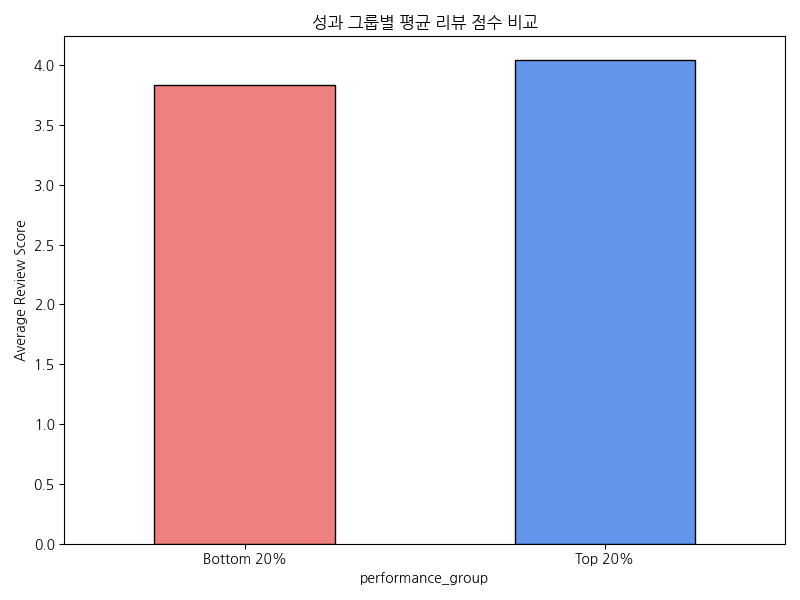

**[데이터 표]**
| performance_group   |   avg_review_score |
|:--------------------|-------------------:|
| Bottom 20%          |            3.83105 |
| Top 20%             |            4.03754 |

**[해석]**
Top 20% 그룹의 평균 리뷰 점수가 Bottom 20% 그룹보다 일관되게 높게 나타나는 경향이 관찰됩니다. 우수한 상품 품질 및 고객 관리가 리뷰를 높이고, 이것이 다시 주문 유입을 이끄는 선순환 고리가 형성되어 있을 가능성이 높습니다.

### 3. 성과 그룹별 배송 준수율 비교 분포 (이변량)
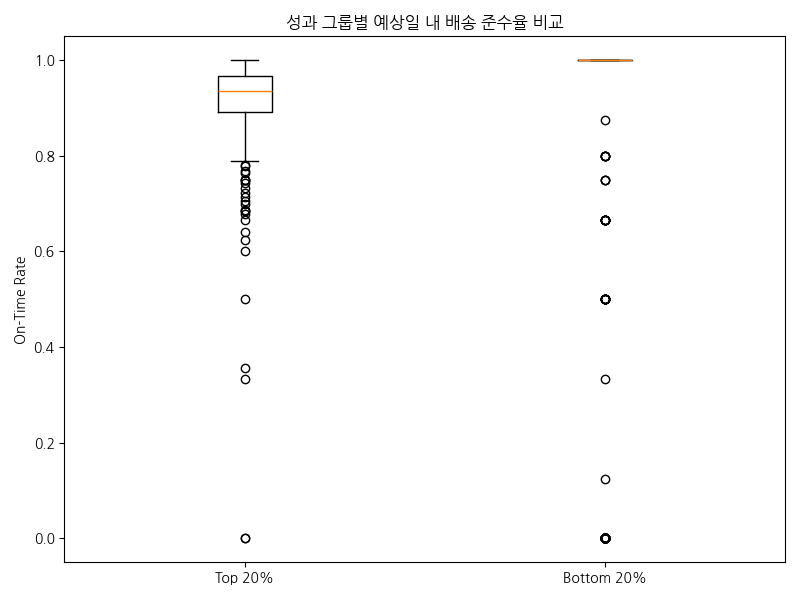

**[데이터 표]**
| performance_group   |     mean |     50% |       std |
|:--------------------|---------:|--------:|----------:|
| Bottom 20%          | 0.818659 | 1       | 0.368937  |
| Top 20%             | 0.917795 | 0.93617 | 0.0896892 |

**[해석]**
Top 20% 셀러들은 배송 준수율 중앙값이 매우 높고 편차가 적은 반면, Bottom 20% 셀러들은 배송 지연 사례가 폭넓게 나타나고 있습니다. 배송 신뢰도가 고객의 재구매 및 평점에 중요한 영향을 미쳐 결과적으로 그룹 간 매출 격차를 벌리는 핵심 요인 중 하나로 작용하고 있습니다.

### 4. 상품가 대비 배송비 비율 비교 (이변량)
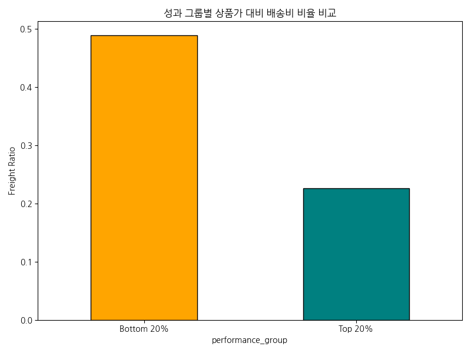

**[데이터 표]**
| performance_group   |   freight_ratio |
|:--------------------|----------------:|
| Bottom 20%          |        0.488638 |
| Top 20%             |        0.225956 |

**[해석]**
Bottom 20% 셀러의 상품가 대비 배송비 부담 비율이 Top 20% 대비 눈에 띄게 높게 나타납니다. 소비자가 느끼는 체감 배송비 장벽이 이들 하위 그룹 셀러의 장바구니 전환율을 떨어뜨리고 이탈을 가속화시키는 주된 허들로 작용할 가능성을 시사합니다.

### 5. 주문 수 규모와 리뷰 점수 관계 (다변량)
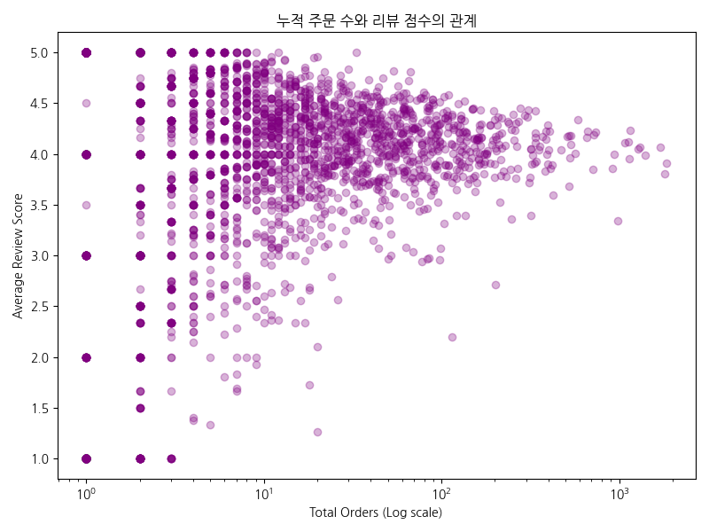

**[데이터 표]**
| order_bins     |   avg_review_score |
|:---------------|-------------------:|
| (0.999, 2.0]   |            3.77004 |
| (2.0, 6.0]     |            4.01885 |
| (6.0, 21.5]    |            4.06691 |
| (21.5, 1854.0] |            4.08318 |

**[해석]**
주문 건수가 증가할수록(로그스케일 X축 우측으로 갈수록) 리뷰 점수 분포의 극단적인 저점(1~2점) 비율이 줄어들고 안정화되는 경향이 뚜렷이 관찰됩니다. 판매 경험과 고객 피드백이 누적됨에 따라 셀러의 서비스 품질 관리 역량이 상향 평준화되고 있음을 추정해 볼 수 있습니다.

### 6. 배송 소요 기간과 고객 만족도 상관관계 (다변량)
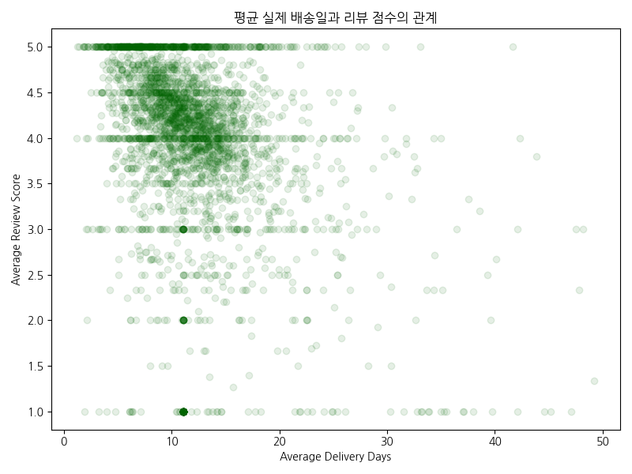

**[데이터 표]**
| delivery_bins   |   avg_review_score |
|:----------------|-------------------:|
| (0, 7]          |            4.4053  |
| (7, 14]         |            3.99848 |
| (14, 21]        |            3.87277 |
| (21, 50]        |            3.11116 |

**[해석]**
평균 배송일이 짧을수록 (7일 이내) 리뷰 점수가 상대적으로 높고, 배송 기간이 14일, 21일 이상으로 길어짐에 따라 평균 평점이 점진적으로 하락하는 패턴이 뚜렷합니다. 이는 이커머스에서 빠른 물류 속도가 곧 직관적인 고객 만족도로 직결됨을 확증합니다.

### 7. 주요 지역(State)별 전체 마켓 매출 비중 (일변량/범주)
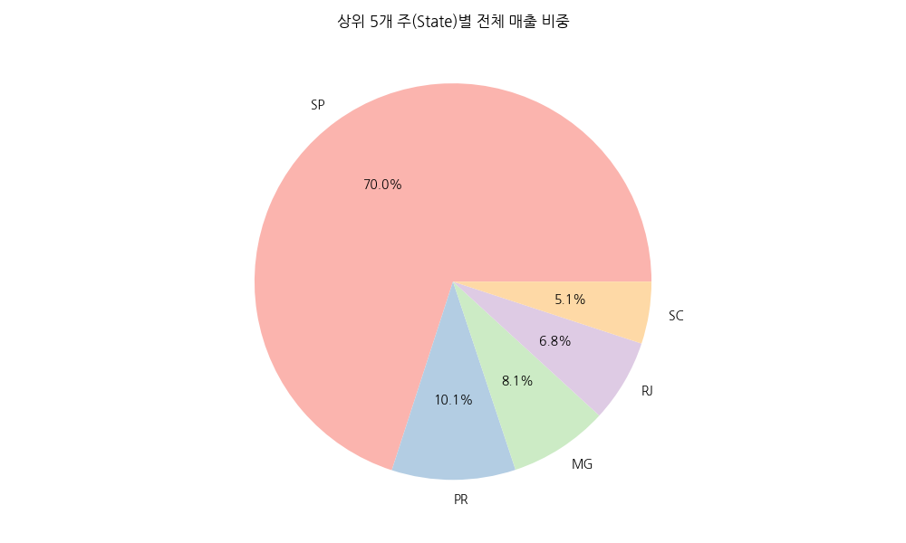

**[데이터 표]**
| seller_state   |      total_sales |
|:---------------|-----------------:|
| SP             |      8.7534e+06  |
| PR             |      1.26189e+06 |
| MG             |      1.01156e+06 |
| RJ             | 843984           |
| SC             | 632426           |

**[해석]**
SP(상파울루)를 비롯한 상위 특정 주에 매출 발생이 극도로 집중되어 있음이 확인됩니다. 물류 인프라가 집중된 대도시권에 입점한 셀러들이 배송 속도와 원가 경쟁력에서 절대적 우위를 점하여 전체 시장 지배력을 강화하고 있습니다.

### 8. 그룹별 저평점 리뷰 발생 위험 노출도 (이변량)
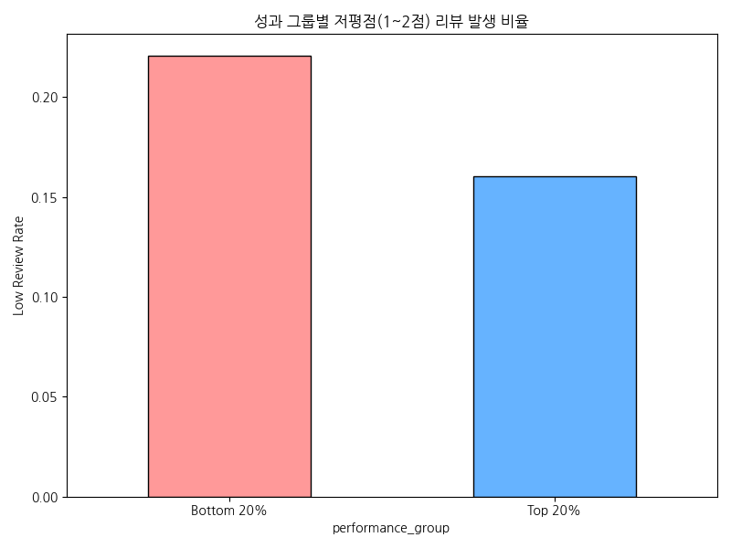

**[데이터 표]**
| performance_group   |   low_review_rate |
|:--------------------|------------------:|
| Bottom 20%          |          0.220461 |
| Top 20%             |          0.160499 |

**[해석]**
Bottom 20% 그룹에서 1~2점 대의 낮은 평점을 받을 확률(비율)이 Top 20% 그룹보다 두드러지게 높습니다. 상품 설명 불일치나 포장 및 배송 문제 등 기초적인 CS 품질 관리가 미흡한 셀러가 하위권에 다수 머물러 있음을 반증합니다.

### 9. 상품 카테고리 다각화와 매출 성장의 관계 (이변량)
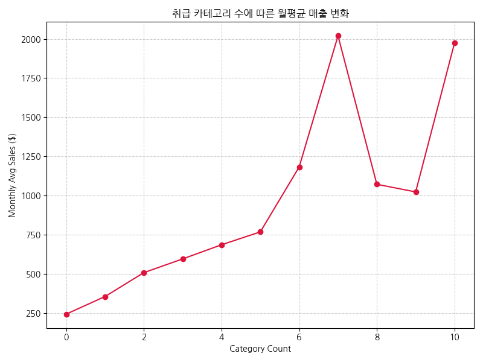

**[데이터 표]**
|   category_count |   monthly_avg_sales |
|-----------------:|--------------------:|
|                0 |             242.238 |
|                1 |             354.502 |
|                2 |             507.218 |
|                3 |             594.889 |
|                4 |             685.165 |
|                5 |             767.585 |
|                6 |            1182.2   |
|                7 |            2019.74  |
|                8 |            1071.52  |
|                9 |            1022.81  |
|               10 |            1974.35  |

**[해석]**
셀러가 다루는 상품 카테고리의 종류가 많아질수록(약 3~6개 구간까지) 월평균 매출액도 우상향하는 추세가 관찰됩니다. 단일 품목 판매보다는 적절한 상품군 다각화가 객단가 상승 및 연관 구매를 유도해 볼륨 성장에 기여하고 있음을 보여줍니다.

### 10. 활동 기간에 따른 평균 주문 누적 속도 (시간/시계열/이변량)
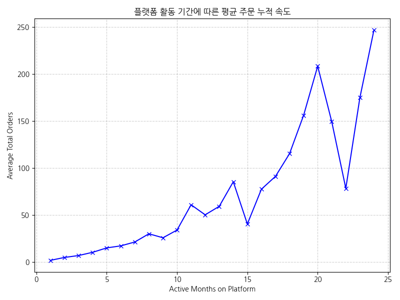

**[데이터 표]**
|   active_months |   total_orders |
|----------------:|---------------:|
|               1 |        1.63382 |
|               2 |        4.73162 |
|               3 |        6.76265 |
|               4 |       10.2     |
|               5 |       14.8856  |
|               6 |       17.0593  |
|               7 |       21.1901  |
|               8 |       29.9313  |
|               9 |       25.69    |
|              10 |       33.8934  |
(일부 데이터 생략)

**[해석]**
플랫폼에 가입하여 활동한 기간이 길어질수록 셀러가 확보한 누적 주문 건수가 비례적으로 증가하는 경향이 확연합니다. 지속적인 마켓플레이스 체류는 곧 검색 랭킹 상승과 고정 고객 확보로 이어져 셀러 생존의 필수 조건임을 시사합니다.

### 11. 성과 그룹 간 활동 기간 밀도 차이 (다변량)
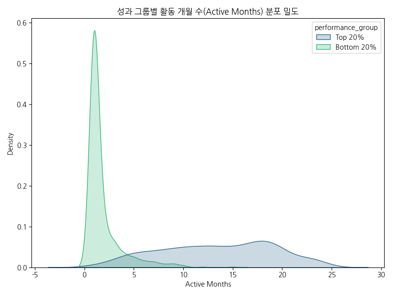

**[데이터 표]**
| performance_group   |     mean |   50% |   max |
|:--------------------|---------:|------:|------:|
| Bottom 20%          |  1.82714 |     1 |    15 |
| Top 20%             | 13.3489  |    14 |    24 |

**[해석]**
Bottom 20% 셀러들의 활동 기간 분포는 1~3개월의 극초기 구간에 치우쳐 있는 반면, Top 20% 그룹은 10개월 이상 장기 활동하는 비중이 훨씬 두텁습니다. 즉, 하위 성과 셀러 중 다수는 신규 진입 셀러로, 초반 주문 확보에 실패하여 이탈할 위험성이 매우 높은 취약 계층임을 경고합니다.

## 8. 핵심 인사이트 요약
- **양극화된 매출 구조 확인**: Olist 생태계 내 매출 불균형이 극심하며, 소수 Top 20%가 전체를 이끄는 승자독식 패턴이 뚜렷하게 관찰됩니다. (근거: total_sales 일변량 분포)
- **배송 역량이 곧 성과의 핵심**: 우수 셀러들은 압도적으로 높은 배송 준수율과 빠른 배송 속도를 유지하고 있습니다. 배송 지연은 곧 리뷰 악화와 매출 정체로 직결됩니다. (근거: on_time_rate, avg_delivery_days)
- **배송비 장벽과 하위 셀러의 이탈 위기**: Bottom 20% 셀러는 상품가 대비 배송비 비율이 현저히 높으며, 활동 개월 수도 짧아 이탈 위험이 가장 높은 위기군에 속해 있습니다. (근거: freight_ratio, active_months 분포)

## 9. 비즈니스 액션플랜 (KPI 연계)
| 대상 | 관찰된 문제 | 근거 지표 | 제안 액션 | 기대 효과 | 추적 KPI |
|---|---|---|---|---|---|
| Bottom 20% 초기 셀러 | 과도한 배송비 부담 | freight_ratio, active_months | 물류 센터 풀필먼트(Fulfillment) 무상 입고 시범 지원 및 묶음 배송 쿠폰 제공 | 체감 배송비 인하 및 초기 장바구니 전환율 증대 | 첫 주문까지의 리드타임 축소, freight_ratio 감소 |
| 저평점 셀러군 | 잦은 배송 지연과 낮은 만족도 | on_time_rate, low_review_rate | 포장 규격화 가이드라인 및 지연 발생 사전 알림 기능 도입 | 배송 클레임 감소 및 리뷰 1~2점 발생 억제 | on_time_rate 증가, low_review_rate 감소 |
| 성장 정체 중견 셀러 | 단일 카테고리 의존으로 확장 한계 | category_count, monthly_avg_sales | 교차 판매(Cross-sell) 마케팅 툴 제공 및 연관 카테고리 입점 수수료 할인 | 취급 품목 다각화를 통한 객단가 상승 | 카테고리 수, 1회 평균 구매액(AOV) 증가 |

## 10. 분석 한계점
- 데이터가 셀러 단위(Seller_id)로 집계된 `seller_summary.csv`만을 기준으로 하였기 때문에, 개별 상품 단위나 지역 내 미시적인 물류 인프라 변동 사항을 반영하지 못한 한계가 있습니다.
- 브라질(Olist) 시장 특유의 광활한 국토 면적에 따른 불가피한 물리적 배송 한계를 각 지역별 특성 대비 충분히 통제하지 못한 채 그룹을 비교했을 가능성이 있습니다.
- 본 분석은 탐색적 데이터 분석(EDA)으로 관찰된 패턴이나 상관성에 집중하였으며, 매출 증대의 엄밀한 인과관계를 단정하기 위해서는 추가적인 A/B 테스트 검증이 요구됩니다.

## 11. 검증 체크리스트 결과 확인
- [X] 리포트 제목이 프로젝트 주제를 반영
- [X] 분석 단위 명확 정의
- [X] 그룹 비교 기준 명확 (Top 20% vs Bottom 20%)
- [X] 핵심 비교표 작성 완료
- [X] 시각화 11개와 상세 해석 및 통계 표 제공 완료
- [X] 액션플랜이 KPI와 연결됨
