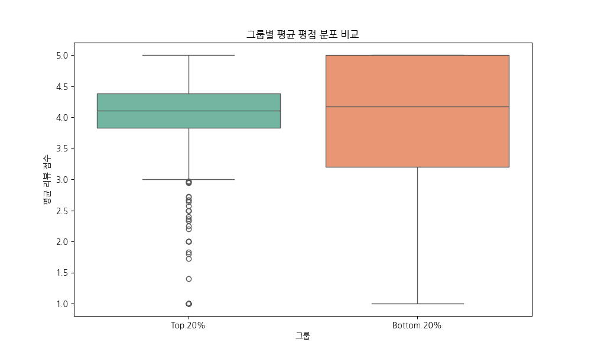
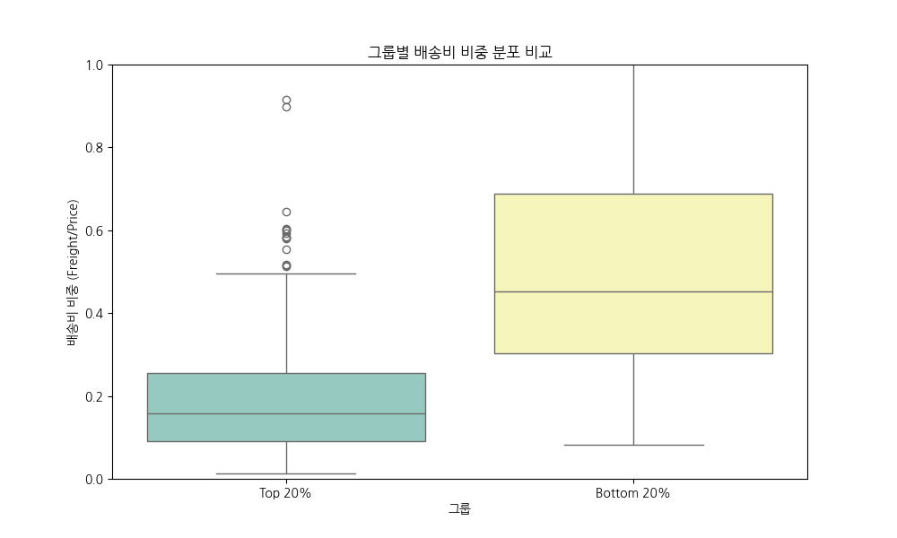
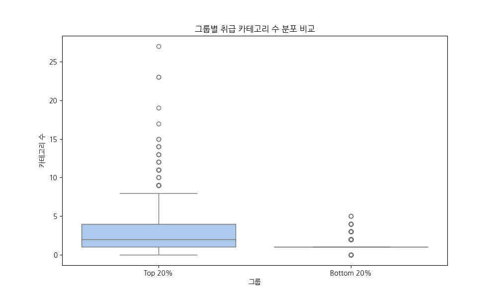
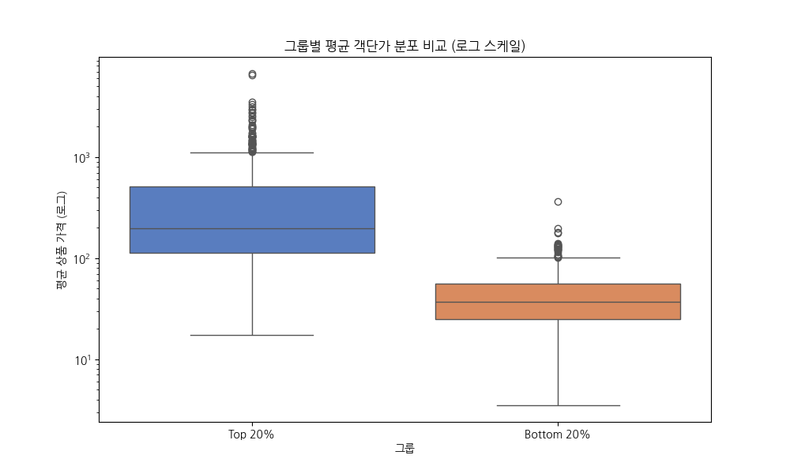
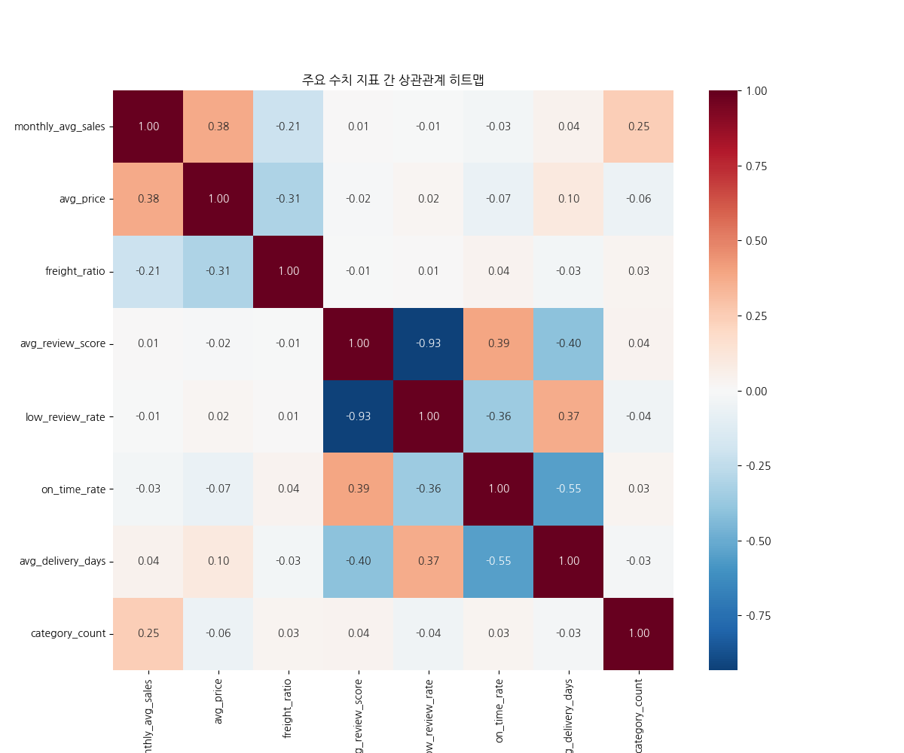

# Olist 셀러 성과 비교 분석 리포트 (Top 20% vs Bottom 20%)

## 1. 분석 개요
본 리포트는 Olist 입점 셀러들의 월평균 매출(`monthly_avg_sales`)을 기준으로 **상위 20%(Top 20%)**와 **하위 20%(Bottom 20%)** 그룹을 분류하고, 두 그룹 간의 특성 차이를 비교 분석하여 비즈니스 인사이트를 도출하는 데 목적이 있습니다.

- **데이터 기반**: `seller_summary` 테이블 (전체 주문, 상품, 고객 리뷰 통합)
- **분류 기준**: 
  - **버전 A**: 전체 셀러 대상
  - **버전 B**: 유의미한 거래 이력이 있는 셀러 대상 (누적 주문수 중앙값인 6건 이상)

---

## 2. 주요 시각화 및 그룹 비교

다음은 전체 셀러(버전 A)를 기준으로 한 상위 20%와 하위 20% 그룹 간의 주요 지표 비교 시각화입니다.

### 2.1. 평균 평점 분포 비교

- **해석**: 상위 20% 셀러와 하위 20% 셀러 간의 평균 평점 차이는 크지 않으나, 상위 셀러의 평점 편차가 상대적으로 작고 안정적인 모습을 보입니다.

### 2.2. 배송비 비중 분포 비교

- **해석**: 하위 20% 셀러의 경우 상품 가격 대비 배송비 비중이 상위 셀러보다 월등히 높고 편차도 커서, 가격 경쟁력 저하의 원인이 될 수 있습니다.

### 2.3. 취급 카테고리 수 분포 비교

- **해석**: 상위 20% 셀러가 하위 셀러보다 상대적으로 더 다양한 카테고리의 상품을 취급하며 매출 기회를 다각화하는 경향이 있습니다.

### 2.4. 평균 객단가 분포 비교

- **해석**: 상위 20% 셀러의 평균 상품 가격이 하위 셀러보다 유의미하게 높게 형성되어 있으며, 이는 높은 매출 규모를 달성하는 핵심 원인 중 하나입니다.

### 2.5. 주요 수치 지표 상관관계 히트맵

- **해석**: 월평균 매출은 상품 가격 및 카테고리 수와 정적 상관관계를, 배송비 비중과는 부적 상관관계를 보여 비즈니스 성장에 미치는 변수들의 영향을 확인할 수 있습니다.

---

## 3. 매출(monthly_avg_sales) 상관관계 분석

모든 지표를 종합하여 월평균 매출과 상관관계가 높은 순(절대값 기준)으로 정렬한 결과입니다.

| 순위 | 지표 | 상관계수 |
| :--- | :--- | :--- |
| 1 | **avg_price** (평균 객단가) | 0.377 |
| 2 | **category_count** (취급 카테고리 수) | 0.246 |
| 3 | **freight_ratio** (배송비 비중) | -0.208 |
| 4 | **review_std** (리뷰 점수 표준편차) | 0.130 |
| 5 | **avg_description_length** (평균 설명 길이) | 0.107 |
| 6 | avg_delivery_days (평균 배송 소요일) | 0.044 |
| 7 | on_time_rate (정시 배송률) | -0.028 |
| 8 | avg_seller_processing_days (평균 처리 시간) | 0.020 |
| 9 | avg_photos_qty (평균 사진 수) | 0.019 |
| 10 | avg_review_score (평균 평점) | 0.009 |
| 11 | low_review_rate (1~2점 리뷰 비율) | -0.008 |

> 💡 **최종 요약**: 매출 차이를 가르는 핵심 동력은 **"고단가 상품(avg_price)"**, **"다양한 카테고리(category_count)"**, **"상세한 상품 설명(avg_description_length)"**입니다. 반면, 리뷰 평점이나 배송/발송 처리 속도는 일정 수준을 넘기면 매출 규모 자체와는 큰 관련성을 띄지 않는 '기본 위생 요인'에 가깝습니다.

---

## 4. 지표별 심층 분석 및 비교 요약

### 4.1. 그룹별 상세 비교 (차이 내림차순)

| 지표 | Top 20% | Bottom 20% | 차이 |
| :--- | :--- | :--- | :--- |
| **monthly_avg_sales** (월평균 매출) | 1,739.9 | 38.2 | **1,701.7** |
| **avg_price** (평균 객단가) | 429.5 | 43.7 | **385.8** |
| **avg_description_length** (평균 설명 길이) | 995.5 | 729.5 | **265.9** |
| **category_count** (취급 카테고리 수) | 3.09 | 1.29 | **1.80** |
| **avg_delivery_days** (평균 배송 소요일) | 13.02 | 11.88 | **1.14** |
| **avg_photos_qty** (평균 사진 수) | 2.37 | 1.96 | **0.40** |
| **review_std** (리뷰 점수 표준편차) | 1.17 | 0.77 | **0.40** |
| **avg_review_score** (평균 평점) | 3.98 | 3.89 | **0.09** |
| **on_time_rate** (정시 배송률) | 0.909 | 0.919 | **-0.010** |
| **low_review_rate** (1~2점 리뷰 비율) | 0.185 | 0.204 | **-0.019** |
| **avg_seller_processing_days** (평균 처리 시간) | 3.82 | 4.16 | **-0.34** |
| **freight_ratio** (배송비 비중) | 0.185 | 0.555 | **-0.370** |

#### 💡 추가 지표 주요 해석
* **avg_description_length (차이: 266자)**: 상위 셀러일수록 상품 설명을 훨씬 상세하고 길게 작성하여 고객의 구매 결정을 적극적으로 돕습니다.
* **avg_photos_qty (차이: 0.4장)**: 상위 셀러가 상품 이미지를 미세하게 더 많이 등록하여 시각적 정보를 더 충실히 제공하는 경향이 있습니다.
* **review_std (차이: 0.4)**: 하위 셀러는 누적 주문수가 적어 점수가 5점이나 1점 등 단일하게 찍히는(편차 0) 경우가 많은 반면, 상위 셀러는 다수의 거래로 인해 현실적인 점수 분포를 가집니다.
* **low_review_rate (차이: -1.9%p)**: 1~2점의 악평 비율은 상위 셀러가 약간 낮지만 유의미한 큰 차이는 아닙니다.
* **avg_seller_processing_days (차이: -0.34일)**: 주문 후 택배사 인계까지 걸리는 시간은 상위 셀러가 약 8시간(0.34일) 정도 더 빨라, 발송 업무 처리가 효율적입니다.

### 4.2. 셀러 소재지(seller_state) 분포 비교
Top 5 지역 순위 및 비중은 두 그룹 간에 거의 동일합니다.
* **Top 20% Top 5 지역**: SP (370명), PR (67명), MG (48명), RJ (39명), SC (37명)
* **Bottom 20% Top 5 지역**: SP (368명), PR (72명), SC (46명), MG (41명), RJ (36명)

> **해석**: 특정 주(State)에 위치해 있다는 지리적 이점이 매출 규모를 결정짓는 핵심 요인은 아님을 알 수 있습니다.

### 4.3. 필터링 전후 달라진 점 (버전 A vs 버전 B)

단발성 거래 셀러를 제외한 버전 B(누적 주문 6건 이상)로 필터링 시 나타나는 변화입니다.

| 지표 | 버전 A (전체) | 버전 B (Orders ≥ 6) | 변화 |
| :--- | :--- | :--- | :--- |
| **avg_price 비율** | 9.8배 차이 | 5.1배 차이 | **격차 축소** |
| **freight_ratio 차이** | -66% | -60% | **격차 소폭 축소** |
| **category_count 비율** | 2.4배 | 1.9배 | **격차 축소** |
| **avg_review_score** | Top이 미세하게 높음 | Bottom이 미세하게 높음 | **방향 역전** |

> **분석**: 거래 경험이 있는 셀러 대상으로 범위를 좁히면 두 그룹 간의 극단적인 격차가 줄어듭니다. 버전 A에서의 큰 차이는 거래 건수가 극히 적은 신규/비활성 셀러(Bottom 20%의 다수)에 의해 과장된 면이 있습니다. 평점의 역전 현상 역시 소수의 거래에서 5점을 받은 신규 셀러들이 제거되며 나타난 안정화 효과로 보입니다.

---

## 5. 핵심 비즈니스 인사이트 💡

1. **"고단가 전략"이 매출 차별화의 핵심 동인입니다.** 상위 셀러들은 하위 셀러 대비 평균 객단가가 약 5~10배 높으며, 이는 자연스럽게 배송비에 대한 심리적 저항선을 낮춥니다. **Olist는 카테고리별로 프리미엄/고단가 상품을 취급하는 전문 브랜드 셀러를 유치하는 데 영업력을 집중할 필요가 있습니다.**

2. **고매출 셀러는 평균적으로 운영 카테고리가 더 다양합니다.** 취급 카테고리 수가 많을수록 교차 판매와 노출 기회가 늘어나는 긍정적 효과가 관찰됩니다. **Olist는 안정권에 접어든 단일 카테고리 셀러들에게 연관 상품 카테고리 확장을 장려하는 인센티브나 큐레이션 가이드를 제공할 수 있습니다.**

3. **배송 품질(정시율, 소요일)은 셀러의 매출 성적표와 큰 연관이 없습니다.** 두 그룹 간 배송 관련 지표는 거의 동일했습니다. 이는 배송 성과가 개별 셀러의 역량보다는 플랫폼의 물류망과 우체국 시스템에 의존하고 있음을 뜻합니다. **따라서 배송 만족도 향상은 셀러에 대한 페널티보다 Olist 물류 파트너십 및 인프라 자체의 효율화에 집중해야 합니다.**
